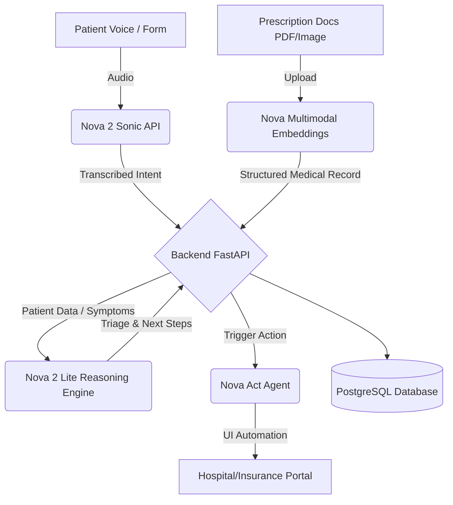

# NovaCare: AI-Powered Healthcare Workflow Automation using Amazon Nova

## 🌟 Project Overview
NovaCare is an end-to-end healthcare automation system built to streamline patient triage, voice registration, document processing, and UI automation for hospital booking systems. Powered by Amazon Nova models—including Nova 2 Sonic for voice, Nova 2 Lite for reasoning, Multimodal Embeddings for medical documents, and Nova Act for UI interactions.

## 🚀 Features
- **Voice AI Interface (Nova 2 Sonic)**: Captures patient audio, transcribes it, and converts it to a structured JSON intent.
- **Medical Document Understanding**: Extracts entities from multimodal prescription uploads using Nova Multimodal Embeddings.
- **Reasoning Engine (Nova 2 Lite)**: Triages symptoms and provides actionable healthcare directions.
- **UI Automation (Nova Act)**: Automates interacting with web portals to book appointments.

## 📊 Architecture Diagram



## 🗄️ Database Schema
We use PostgreSQL.
- `patients`: id, name, dob, contact, created_at
- `documents`: id, patient_id, file_url, parsed_data (JSON), uploaded_at
- `visits`: id, patient_id, triage_result, assigned_department, status
- `agents_logs`: id, action, status, timestamp

## 🛠️ Tech Stack
- **Frontend**: React, Vite, Tailwind CSS
- **Backend**: Python FastAPI, SQLAlchemy
- **Database**: PostgreSQL
- **AI Models**: Amazon Nova (2 Sonic, 2 Lite, Act, Embeddings)

## 🏃 Setup Instructions (Local & AWS)
### Prerequisites
- Python 3.9+
- Node.js 18+
- PostgreSQL
- AWS Account with Nova models access.

### Local Setup
1. **Database**: Create a Postgres database named `novacare`.
2. **Backend**:
   ```bash
   cd backend
   python -m venv venv
   source venv/bin/activate
   pip install -r requirements.txt
   uvicorn main:app --reload
   ```
3. **Frontend**:
   ```bash
   cd frontend
   npm install
   npm run dev
   ```

### AWS Deployment
1. Package the FastAPI backend using Docker / AWS Lambda Web Adapter.
2. Deploy the Frontend to AWS S3 + CloudFront.
3. Use Amazon RDS for PostgreSQL.
4. Set up IAM roles with exact permissions for Amazon Nova model invocations.
